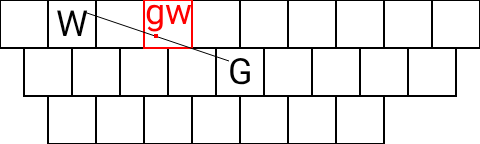
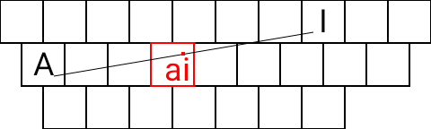
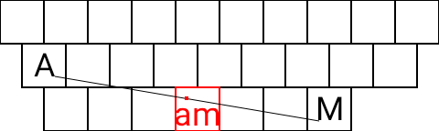
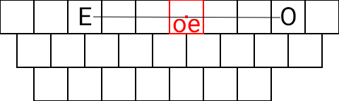

# SGPB 雙拼
基於 Rime 中州韻輸入法引擎，依賴於 [`rime-cantonese`](https://github.com/rime/rime-cantonese)，採用[香港語言學學會粵語拼音方案](https://www.lshk.org/jyutping)。
## 簡介
**SGPB 雙拼**係一種粵語拼音編碼方案，擁有**淸楚易記嘅按鍵位置**。  

## 鍵位圖
採用 QWERTY 佈局
<h3>SGPB 雙拼</h3>
<ul><li>配方：℞ <code>sgpb</code></li></ul>
<table>
	<tr valign="top">
		<td><b>1</b></td>
		<td><b>2</b></td>
		<td><b>3</b></td>
		<td><b>4</b></td>
		<td><b>5</b></td>
		<td><b>6</b></td>
		<td><b>7</b></td>
		<td><b>8</b></td>
		<td><b>9</b></td>
		<td><b>0</b></td>
	</tr>
	<tr valign="top">
		<td><b>Q</b> aau</td>
		<td><b>W</b> aai</td>
		<td><b>E</b></td>
		<td><b>R</b> gw yut yun ut un</td>
		<td><b>T</b> eot eon ot on</td>
		<td><b>Y</b> yu jyu oe</td>
		<td><b>U</b> ou</td>
		<td><b>I</b> kw ei ji</td>
		<td><b>O</b></td>
		<td><b>P</b> oi</td>
	</tr>
	<tr valign="top">
		<td><b>A</b> aa</td>
		<td><b>S</b> at an</td>
		<td><b>D</b> au</td>
		<td><b>F</b> ai</td>
		<td><b>G</b> oek oeng</td>
		<td><b>H</b> it in jit jin</td>
		<td><b>J</b> eoi ui</td>
		<td><b>K</b> iu jiu</td>
		<td><b>L</b> ip im</td>
		<td><b>;</b></td>
	</tr>
	<tr valign="top">
		<td><b>Z</b> aat aan</td>
		<td><b>X</b> aap aam</td>
		<td><b>C</b> aak aang ak ang</td>
		<td><b>V</b> ng ap am</td>
		<td><b>B</b> ek eng ik ing jeng jik jing</td>
		<td><b>N</b> uk ung</td>
		<td><b>M</b> ok ong</td>
		<td><b>,</b></td>
		<td><b>.</b></td>
		<td><b>/</b></td>
	</tr>
</table>

	
<h3>其他方案</h3>

	<h3>SQMPIV 三拼</h3>
	<ul><li>配方：℞ <code>sqmpiv</code></li></ul>
	<table>
		<tr valign="top">
			<td><b>1</b></td>
			<td><b>2</b></td>
			<td><b>3</b></td>
			<td><b>4</b></td>
			<td><b>5</b></td>
			<td><b>6</b></td>
			<td><b>7</b></td>
			<td><b>8</b></td>
			<td><b>9</b></td>
			<td><b>0</b></td>
		</tr>
		<tr valign="top">
			<td><b>Q</b> aa</td>
			<td><b>W</b></td>
			<td><b>E</b></td>
			<td><b>R</b> gw eo oe</td>
			<td><b>T</b></td>
			<td><b>Y</b> kw yu</td>
			<td><b>U</b></td>
			<td><b>I</b></td>
			<td><b>O</b></td>
			<td><b>P</b></td>
		</tr>
		<tr valign="top">
			<td><b>A</b></td>
			<td><b>S</b></td>
			<td><b>D</b></td>
			<td><b>F</b></td>
			<td><b>G</b></td>
			<td><b>H</b></td>
			<td><b>J</b></td>
			<td><b>K</b></td>
			<td><b>L</b></td>
			<td><b>;</b></td>
		</tr>
		<tr valign="top">
			<td><b>Z</b></td>
			<td><b>X</b></td>
			<td><b>C</b></td>
			<td><b>V</b> ng</td>
			<td><b>B</b></td>
			<td><b>N</b></td>
			<td><b>M</b></td>
			<td><b>,</b></td>
			<td><b>.</b></td>
			<td><b>/</b></td>
		</tr>
	</table>

## 使用說明
### 聲調輸入
* 配方：℞ `sg1pb3`  
爲咗區分入聲字同非入聲字，可以撳 <kbd>1</kbd> ‒ <kbd>9</kbd> 嚟用聲調篩選。
### 注意
- 對於拼音 `gu`、`gui`、`gun`、`ku`、`kui`、`kut`，聲母要串成 `gw`、`kw`。

	
即係話，

	如果要打個「古」字，應該撳 <kbd>R</kbd><kbd>U</kbd> 而唔係 <kbd>G</kbd><kbd>U</kbd>。
	<h4>所有情況</h4>
	<table>
		<tr valign="top">
			<th>聲＼韻</th>
			<th><kbd>U</kbd></th>
			<th><kbd>R</kbd></th>
			<th><kbd>T</kbd></th>
		</tr>
		<tr valign="top">
			<th><kbd>G</kbd></th>
			<td><code>gou</code></td>
			<td><code>gyut</code> <code>gyun</code></td>
			<td><code>geoi</code></td>
		</tr>
		<tr valign="top">
			<th><kbd>R</kbd></th>
			<td><code>gu</code></td>
			<td><code>gun</code></td>
			<td><code>gui</code></td>
		</tr>
		<tr valign="top">
			<th><kbd>K</kbd></th>
			<td></td>
			<td><code>kyut</code> <code>kyun</code></td>
			<td><code>keoi</code></td>
		</tr>
		<tr valign="top">
			<th><kbd>Y</kbd></th>
			<td><code>ku</code></td>
			<td><code>kut</code></td>
			<td><code>kui</code></td>
		</tr>
	</table>

### 未聽講過雙拼？
**雙拼**係拼音輸入法嘅一種編碼方案。用雙拼打字嘅時候只需要分別撳一下聲母同韻母總共兩個掣就可以打出任意一個漢字。詳見[維基百科](https://zh.wikipedia.org/wiki/%E5%8F%8C%E6%8B%BC)。
### 示例
| 例句 | 廣東人講廣東話，唔識尊重返鄉下。 |
|:---|:---|
| 粵拼全拼 | `gwongdungjangonggwongdungwaa，msikzyunzungfaanhoenghaa。` |
| SGPB 雙拼 | `rmdnjsgmrmdnwa，msbzrznfzhgha。` |
